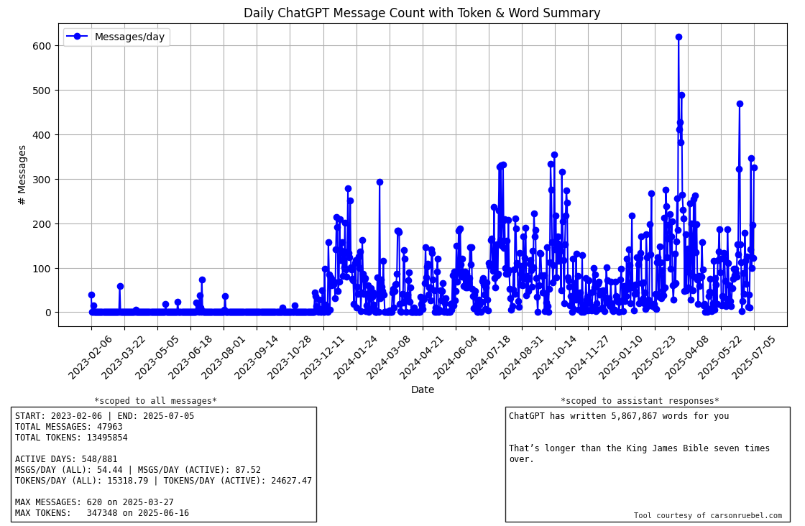

# ChatGPT Usage Analyzer

**ChatGPT Usage Analyzer** is a simple, privacy-first tool to visualize your personal ChatGPT activity, including number of messages per day, token usage, and total usage over time. 

It works entirely offline on your own machine. No data is uploaded or shared.

[Download](https://github.com/carsonruebel/chatgpt-usage-analyzer/raw/main/downloads/ChatGPT-Usage-Analyzer.zip)

---

## What It Does

- Parses your exported ChatGPT 'conversations.json' file
- Displays a daily message count graph with token usage summary
- Highlights your most active and most verbose days
- Works with both **ChatGPT Free** and **ChatGPT Plus**
- Includes data from **archived chats**
- Requires **no coding** and **no installation** of Python

---

## How to Use

1. **Export your ChatGPT data**  
   Visit: [https://chatgpt.com/#settings/DataControls](https://chatgpt.com/#settings/DataControls)  
   Click **“Export data”** and wait for the email.  
   It may take 5 or more minutes to arrive.  
   Be sure to check your junk or spam folder.

2. **Download and unzip your export**  

   Inside, you'll find a file named 'conversations.json'.

3. **Download this analyzer**  
   Either:
   - Download the '.zip' version with included portable Python  
   - Or clone this repo manually
   Extract the contents of the '.zip'

4. **Move the conversations.json file**  
   Find the 'conversations.json' file and place it into the ChatGPT-Usage-Analyzer directory.

5. **Run the tool**  
   Double-click 'run-analyzer.bat'  
   A console window will briefly appear, followed by an image being generated (chatgpt_usage.png).
   This image should auto-open, but if not you'll find it in the ChatGPT-Usage-Analyzer directory.

   ⚠️ **Windows SmartScreen Notice:**  
   You may see a warning like *“Windows protected your PC”*. This is expected for unsigned '.bat' files from new sources.  
   - Click **“More info”**  
   - Then click **“Run anyway”**  
   
   The script runs **locally only** and does **not connect to the internet**.  
   You can also right-click and **choose “Edit”** to review the code before running.

---

## FAQ

### Does this include archived conversations?
Yes, archived chats are included in the exported 'conversations.json'.

### Does this work with free accounts?
Yes, both **Free** and **Plus** users can use this.

### Why is it a '.bat' file instead of an '.exe'?
This is left as a simple '.bat' file to allow:
- Easier inspection of the code
- Better security transparency for cautious users
- Portability and minimal system requirements

### What about Mac support?
Currently untested on macOS. Contributions welcome!

---

## Included Files

- 'run-analyzer.bat' – Launch script
- 'resources/' – Contains embedded Python, required libraries, and analysis script

---

## Privacy & Security

- Your data **never leaves your computer**
- No third-party services are used
- All code is included and readable

---

## Example Output

---

## Feedback & Contributions

Pull requests, bug reports, and suggestions are welcome!  
Feel free to fork and improve.

---

## Licenses

This project is licensed under the MIT License.

Bundled third-party software (e.g., Python, matplotlib) is licensed under their respective terms. License files are included where required.

---

## Contact

GitHub: https://github.com/carsonruebel/chatgpt-usage-analyzer  
Personal Site: https://www.carsonruebel.com

---

Created by Carson Ruebel
